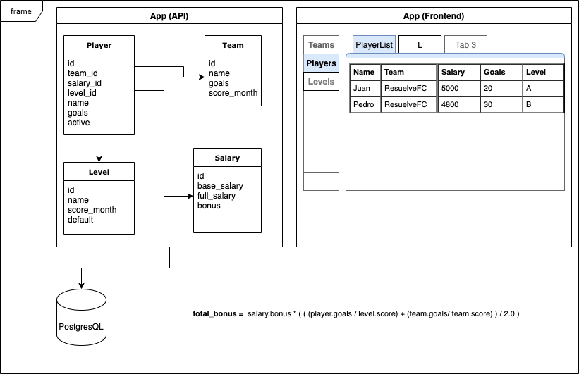

# Resuelve Football Club

**Resuelve FC** is an ruby backend application to compute the full salary of soccer player who gets bonus salary depending on the level and number of goals in the game.

### Dependencies

Dependecies of this project are located in the Gemfile. But the main are these ones:

- elixir: "~> 1.7",
- phoenix: "~> 1.5.12"

We need to create a new role in the PostgresQL (10) to create a DB:

- CREATE ROLE resuelve PASSWORD 'resuelve' NOSUPERUSER CREATEDB CREATEROLE INHERIT LOGIN;

### Run the app

To start your Phoenix server:

- Clone this project and enter to the new directory
- Install dependencies with `mix deps.get`
- Create and migrate your database with `mix ecto.setup`
- Install Node.js dependencies with `npm install` inside the `assets` directory
- Start Phoenix endpoint with `mix phx.server`
- Now you can visit [`http://localhost:7000/`](http://localhost:7000/) from your browser.

In this case we have the `seeds.exs` file where you can find some records to be inserted.

### Run the tests

- mix test --trace

## Technical Documentation

- This project has the next architecture:
  

- You can test the API with Postman or the Thunder Cliente Vscode plugin:
  

## Learn more

- Official website: https://www.phoenixframework.org/
- Guides: https://hexdocs.pm/phoenix/overview.html
- Docs: https://hexdocs.pm/phoenix
- Forum: https://elixirforum.com/c/phoenix-forum
- Source: https://github.com/phoenixframework/phoenix
